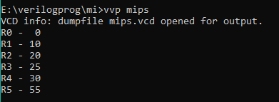

# MIPS32_Non_pipelined

 MIPS32 is a 32-bit processor designed by MIPS Computer Systems in the year 1985. It has RISC based instruction set architecture which has 32 internal general purpose registers R0-R31, each of which has data width of 32-bits or 4 bytes. The data in register R0 is always zero which serves the purpose of moving immediate data to the other registers.

The instruction memory and data memory are kept separate in order to access both memories at the same point of time. This processor supports very few addressing modes. Addressing modes are the ways of specifying the location of the operand through the instructions on which operations are to be done. The various addressing modes available to MIPS32 are: 

1. <b>Register Addressing Mode</b> : The operand is stored in one of the registers among R0-R31.

2. <b>Immediate Addressing Mode</b> : The operand is stored is specified in the instruction itself.

3. <b>Base Indexed Addressing Mode</b> : Here a register with and offset is provided in a single instruction. The content of register is added with the offset to obtain an address in the memory where operand is stored. 

## Types of Instructions

Here two types of instruction formats are specified which have been used in the instruction encoding:

1. <b>R-type Instructions<b> :  
 
 | Opcode | Operation |
 | --- | --- |
 | `ADD` | Adds Rs & Rt and stores in Rd |
 | `SUB` | Subtracts Rs with Rt and stores in Rd |
 | `AND` | Performs logical and between Rs & Rt and stores in Rd |
 | `OR` | Performs logical or between Rs & Rt and stores in Rd |
 | `SLT` | Sets Rd if Rs<Rt |
 | `MUL` | Multiplies Rs with Rt and stores in Rd |
 | `HLT` | Halt |
 
2. I-type instruction

 | Opcode | Operation |
 | --- | --- |
 | `LW` | Load content of memory location given (Rs)+offset and store it in Rt |
 | `SW` | Store content of Rt to memory location given by (Rs)+offset |
 | `ADDI` | Adds Rs & immediate data and stores in Rt |
 | `SUBI` | Subtracts Rs with immediate data and stores in Rt |
 | `SLTI` | Sets Rt if Rs<(Immediate data) |
 | `BNEQZ` | Branch if Rs is not equal to zero to specified label |
 | `BEQZ` | Branch if Rs is equal to zero to specified label |
 

<i>Following conventions are used in image:</i> 
(a) <b><i>Rs</i></b> : Source register 1 
(b) <b><i>Rt</i></b> : Source register 2 
(c) <b><i>Rd</i></b> : Destination register 
(d) <b><i>shamt</i></b> : Shift amount 
(e) <b><i>funct</i></b> : opcode extension 

Examples of R-type instruction : ADD R15,R2,R3; OR R5,R3,R2; MUL R2,R2,R1.  
Examples of I-type instruction : ADDI R15,R0,20; LW R20,84(R9) (Load content of memory location (R9)+84 to R20).  

## MIPS32 Non-pipelined architecture

<i>Credits: Image from taken from Computer Organization and Design: the Hardware/Software Interface (Patterson, Hennessy)</i>

## Example Programs

<b>1. To add three numbers and store result in a register.</b>

 | Instruction | Operation |
 | --- | --- |
 | ADDI R1,R0,10 | (R1)=10 |
 | ADDI R2,R0,20 | (R2)=20 |
 | ADDI R3,R0,25 | (R3)=25 |
 | OR R7,R7,R7 | Stall instruction |
 | ADD R4,R1,R2 | (R4)=(R1)+(R2) |
 | OR R7,R7,R7 | Stall instruction |
 | ADD R5,R4,R3 | (R5)=(R4)+(R3) |
 | HLT | Halt |
 
 The following result was obtained upon execution 
 

